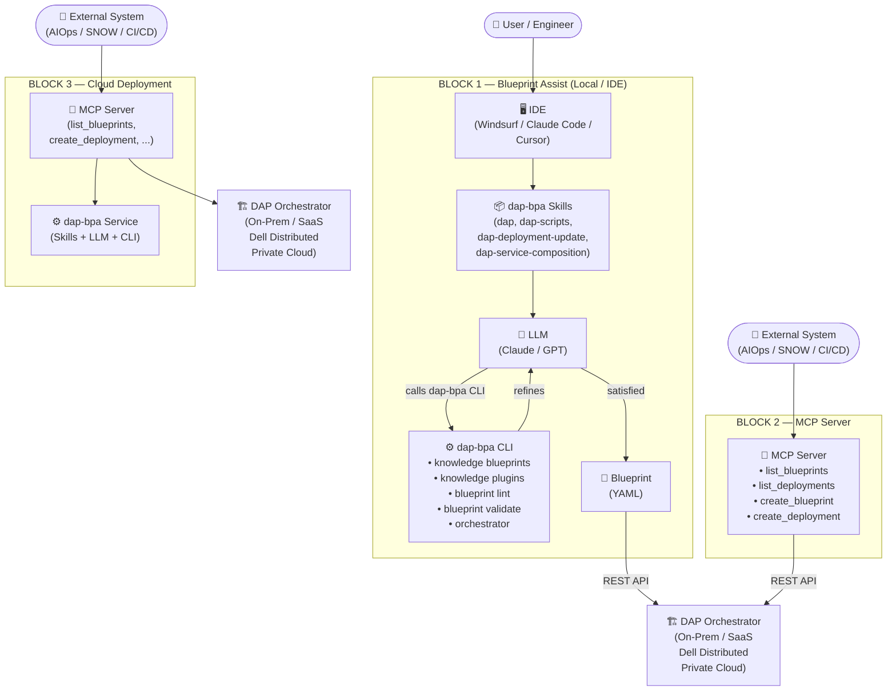
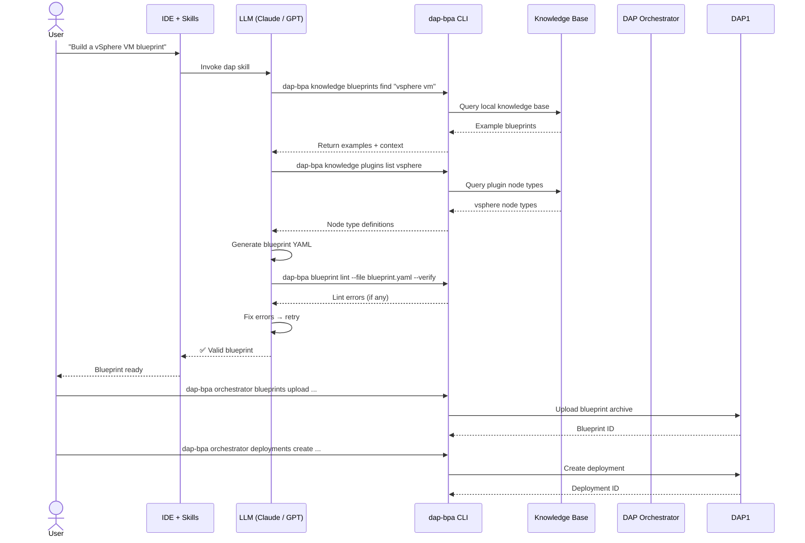
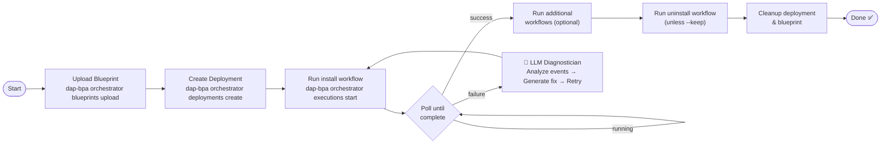
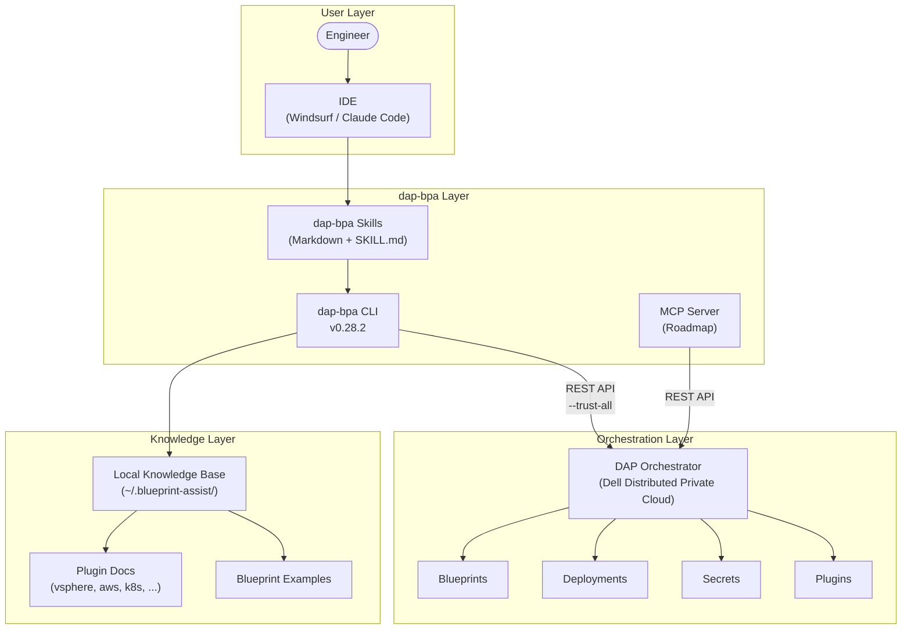
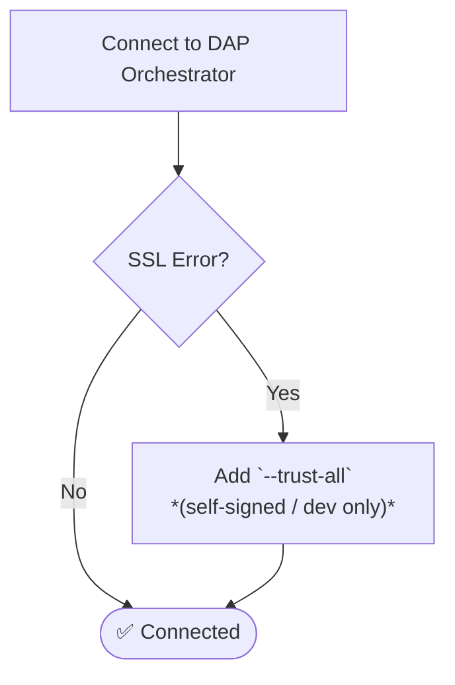
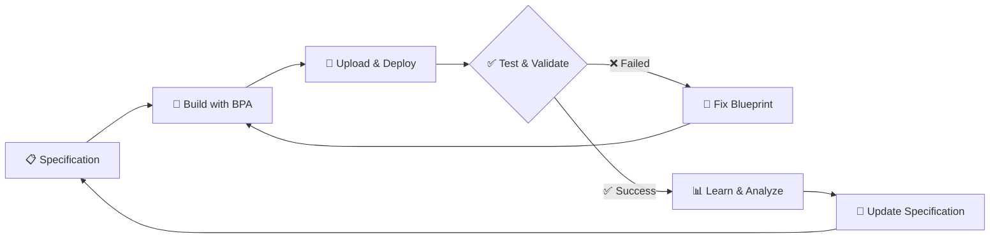

# Section 014: Blueprint Assist Architecture Diagrams

A visual reference for the Blueprint Assist system architecture, workflows, and component relationships.

---

## 1. System Architecture Overview

The dap-bpa system spans three deployment blocks. Block 1 (local/IDE) is the current model; Block 2 (MCP Server) and Block 3 (cloud deployment) will be availabe in the future.

---

## 2. Blueprint Authoring Workflow

How dap-bpa takes a natural language request and produces a deployable blueprint.

---

## 3. Monitor Agent Lifecycle

The `dap-bpa monitor` command automates the full blueprint test loop.

---

## 4. Component Relationships

How the dap-bpa components relate to one another at a glance.

---

## 5. SSL/TLS Connection Options

Quick reference for connecting to orchestrators with certificate issues.

---

## 6. Specification-Driven Development Feedback Loop

The complete SDD cycle from specification through deployment back to specification improvement.

**Detailed feedback loop documentation**: [Specification Feedback Loop](specification-feedback-loop.md)

---

## Reference

- **Full CLI commands**: [Section 013 — dap-bpa CLI Command Reference](../section-013-bpa-cli-commands/content.md)
- **Skills architecture narrative**: [Section 005 — Skills-Based Architecture](../section-005-skills-architecture/content.md)
- **Monitor deep-dive**: [Section 008 — Blueprint Monitoring](../section-008-blueprint-monitoring/content.md)
- **Authentication & SSL**: [Section 003 — Orchestration Service Authentication](../section-003-orchestration-service-auth/content.md)
- **Specification methodology**: [Section 018 — Specification Considerations](../section-018-spec-considerations/content.md)
- **Feedback loop details**: [Specification Feedback Loop](specification-feedback-loop.md)
