# Specification-Driven Development Feedback Loop

## Overview

This diagram illustrates the complete specification-driven development (SDD) feedback loop: from initial specification through blueprint authoring, deployment, testing, and back to specification improvement. This continuous improvement cycle ensures that blueprints evolve based on real deployment experience.

## Feedback Loop Diagram

```mermaid
flowchart TD
    Start([📋 Start: Business Requirement])
    
    subgraph SPECIFICATION["SPECIFICATION PHASE"]
        SpecWrite["Write Specification\n(spec.md, plan.md, research.md)"]
        SpecReview["Stakeholder Review\n& Approval"]
        SpecValid["Specification Validated\n✅ Ready for Implementation"]
    end
    
    subgraph AUTHORING["BLUEPRINT AUTHORING PHASE"]
        BPABuild["Build with BPA\n@dap skill + knowledge base"]
        LintValidate["Lint & Validate\ndap-bpa blueprint lint --verify"]
        BlueprintReady["Blueprint Validated\n✅ Ready for Deployment"]
    end
    
    subgraph DEPLOYMENT["DEPLOYMENT PHASE"]
        Upload["Upload to Orchestrator\ndap-bpa orchestrator blueprints upload"]
        CreateDeploy["Create Deployment\ndap-bpa orchestrator deployments create"]
        Execute["Execute Install Workflow\ndap-bpa orchestrator executions start"]
        Monitor["Monitor Execution\ndap-bpa orchestrator events get"]
    end
    
    subgraph TESTING["TESTING & ITERATION PHASE"]
        DeploySuccess{"Deployment\nSuccessful?"}
        ValidateSpec{"Validate Against\nSpecification"}
        SpecMatches{"Deployment Matches\nSpecification?"}
        IterateFix["Iterate & Fix\nBlueprint or Configuration"]
        RetryDeploy["Retry Deployment"]
    end
    
    subgraph FEEDBACK["FEEDBACK & LEARNING PHASE"]
        ExtractData["Extract Deployment Data\n• Execution logs\n• Performance metrics\n• Resource usage\n• Runtime properties"]
        AnalyzeGaps["Analyze Gaps & Learnings\n• Missing requirements\n• Over-provisioning\n• Performance issues\n• Security gaps"]
        IdentifyImprovements["Identify Spec Improvements\n• Cost optimization\n• Performance tuning\n• Missing features\n• Documentation gaps"]
    end
    
    subgraph IMPROVEMENT["SPECIFICATION UPDATE PHASE"]
        UpdateSpec["Update Specification\n(v1.0 → v1.1 → v1.2)"]
        DocumentRationale["Document Rationale\n• Why changes made\n• Cost impact\n• Performance impact"]
        ShareLearnings["Share Learnings\n• Team knowledge base\n• Best practices\n• Training materials"]
        SpecImproved["Specification Improved\n✅ Ready for Next Iteration"]
    end
    
    Start --> SpecWrite
    SpecWrite --> SpecReview
    SpecReview --> SpecValid
    
    SpecValid --> BPABuild
    BPABuild --> LintValidate
    LintValidate --> BlueprintReady
    
    BlueprintReady --> Upload
    Upload --> CreateDeploy
    CreateDeploy --> Execute
    Execute --> Monitor
    
    Monitor --> DeploySuccess
    
    DeploySuccess -- "❌ Failed" --> IterateFix
    IterateFix --> RetryDeploy
    RetryDeploy --> Execute
    
    DeploySuccess -- "✅ Success" --> ValidateSpec
    ValidateSpec --> SpecMatches
    
    SpecMatches -- "❌ No" --> IterateFix
    IterateFix --> RetryDeploy
    
    SpecMatches -- "✅ Yes" --> ExtractData
    ExtractData --> AnalyzeGaps
    AnalyzeGaps --> IdentifyImprovements
    IdentifyImprovements --> UpdateSpec
    UpdateSpec --> DocumentRationale
    DocumentRationale --> ShareLearnings
    ShareLearnings --> SpecImproved
    
    SpecImproved --> BPABuild
    
    style SPECIFICATION fill:#e1f5ff
    style AUTHORING fill:#fff4e1
    style DEPLOYMENT fill:#e8f5e9
    style TESTING fill:#fce4ec
    style FEEDBACK fill:#f3e5f5
    style IMPROVEMENT fill:#fff3e0
```

## Detailed Phase Descriptions

### 1. Specification Phase

**Input**: Business requirements from stakeholders
**Activities**:

- Write comprehensive specification (spec.md, plan.md, research.md, data-model.md)
- Conduct stakeholder reviews and obtain approval
- Validate specification against constitution and standards
**Output**: Approved specification ready for implementation

### 2. Blueprint Authoring Phase

**Input**: Approved specification
**Activities**:

- Use BPA with @dap skill to generate blueprint from specification
- Query knowledge base for relevant examples and node types
- Lint blueprint with `dap-bpa blueprint lint --verify`
- Validate all nodes with `dap-bpa blueprint validate-all`
**Output**: Validated blueprint ready for deployment

### 3. Deployment Phase

**Input**: Validated blueprint
**Activities**:

- Upload blueprint to orchestrator: `dap-bpa orchestrator blueprints upload`
- Create deployment with inputs: `dap-bpa orchestrator deployments create`
- Execute install workflow: `dap-bpa orchestrator executions start`
- Monitor execution in real-time: `dap-bpa orchestrator events get`
**Output**: Running deployment with execution status

### 4. Testing & Iteration Phase

**Input**: Deployment execution results
**Activities**:

- Validate deployment success against specification
- Check if deployment matches specification requirements
- Iterate on blueprint or configuration if needed
- Retry deployment until success
**Output**: Successful deployment that meets specification

### 5. Feedback & Learning Phase

**Input**: Successful deployment data
**Activities**:

- Extract deployment data (logs, metrics, resource usage, runtime properties)
- Analyze gaps between specification and actual deployment
- Identify improvement opportunities (cost, performance, features, security)
**Output**: List of specification improvements and lessons learned

### 6. Specification Update Phase

**Input**: Lessons learned and improvement opportunities
**Activities**:

- Update specification with new insights (v1.0 → v1.1 → v1.2)
- Document rationale for all changes
- Share learnings across organization
**Output**: Improved specification ready for next iteration

## Key Feedback Loop Mechanisms

### Cost Optimization Feedback

- **Detection**: Analyze actual resource usage vs. specification
- **Action**: Update specification with optimized resource sizing
- **Result**: Reduced infrastructure costs in subsequent deployments

### Performance Feedback

- **Detection**: Measure deployment time and operational performance
- **Action**: Update success criteria and performance targets
- **Result**: Faster deployments and better performance

### Feature Gap Feedback

- **Detection**: Identify missing requirements during deployment
- **Action**: Add missing features to specification
- **Result**: More complete blueprints in next iteration

### Security Feedback

- **Detection**: Discover security gaps during deployment
- **Action**: Enhance security requirements in specification
- **Result**: More secure deployments over time

### Documentation Feedback

- **Detection**: Identify unclear or missing documentation
- **Action**: Improve specification clarity and completeness
- **Result**: Better maintainability and knowledge transfer

## Continuous Improvement Metrics

Track these metrics to measure feedback loop effectiveness:

| Metric | Description | Target |
|--------|-------------|--------|
| **Cost Reduction** | % cost reduction per iteration | 10-20% per cycle |
| **Deployment Time** | % improvement in deployment speed | 15-25% per cycle |
| **Spec Accuracy** | % of specification requirements met | >95% |
| **Iteration Count** | Number of deployment attempts per spec | <3 attempts |
| **Learning Capture** | % of lessons learned documented | 100% |
| **Time to Feedback** | Days from deployment to spec update | <7 days |

## Integration with Existing Documentation

This feedback loop complements existing documentation:

- **[Section 018: Specification Considerations](../section-018-spec-considerations/content.md)** - Specification methodology
- **[Section 007: Building Blueprints](../section-007-building-blueprints/content.md)** - Blueprint authoring
- **[Section 008: Blueprint Monitoring](../section-008-blueprint-monitoring/content.md)** - Deployment monitoring
- **[Section 012: Hands-On Workshop](../section-012-hands-on-workshop/content.md)** - Practical exercises
- **[Demo 20: Reverse Engineering](../../4.examples/recorded-demos/DEMO-PLAN-SECTIONS-018-020.md#demo-20-reverse-engineering-deployed-blueprints-closing-the-feedback-loop)** - Complete workflow demonstration

## Best Practices

### 1. Version Control Specifications

- Track specification versions alongside blueprint versions
- Use semantic versioning (v1.0, v1.1, v1.2)
- Link blueprint versions to specification versions

### 2. Document Rationale

- Always document why specification changes were made
- Include cost and performance impact analysis
- Reference specific deployment experiences

### 3. Share Learnings

- Create a lessons learned repository
- Conduct post-deployment review meetings
- Update organizational best practices

### 4. Automate Data Collection

- Use `dap-bpa monitor` for automated testing
- Collect metrics consistently across deployments
- Standardize data extraction and analysis

### 5. Close the Loop Quickly

- Aim for <7 days from deployment to spec update
- Schedule regular feedback review sessions
- Make feedback loop part of the standard workflow

## Example Feedback Loop Timeline

**Iteration 1 (Week 1-2)**:

- Day 1-2: Write specification v1.0
- Day 3-4: Author blueprint v1.0 with BPA
- Day 5: Deploy and test
- Day 6-7: Analyze results, identify improvements
- Day 8: Update specification to v1.1

**Iteration 2 (Week 3-4)**:

- Day 1-2: Author blueprint v1.1 based on spec v1.1
- Day 3: Deploy and test
- Day 4-5: Validate improvements
- Day 6-7: Document final learnings
- Day 8: Archive as production-ready blueprint

## Conclusion

The specification-driven development feedback loop transforms blueprints from static artifacts into living, evolving components of your infrastructure. Each deployment teaches valuable lessons that inform the next iteration, leading to continuous improvement in cost, performance, security, and maintainability.