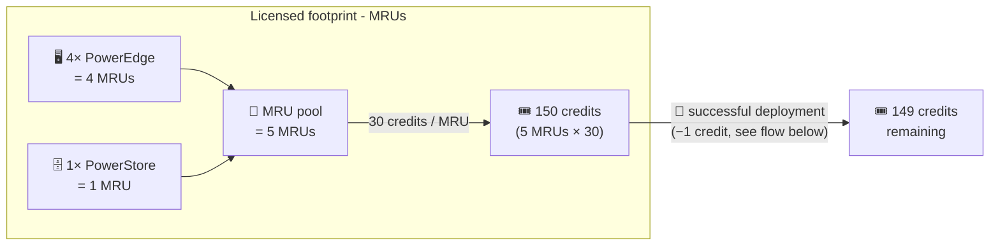
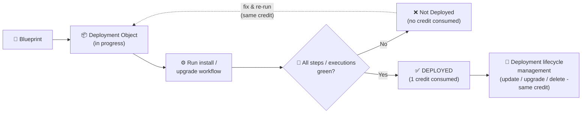

# Section 022: Licensing Model

> This is a reference covering how the Dell Automation Platform and Dell Automation Studio are licensed and packaged. No dap-bpa tooling is required to read it. For the offer and capability details, see [Section 015: Dell Automation Studio Offer Details](../section-015-studio-offer-details/content.md); for the blueprint catalog, see [Section 020: Dell Automation Studio Catalog](../section-020-dell-automation-studio-catalog/content.md).

## Overview

This section explains the licensing model behind Dell Automation Studio: what requires a license, how the platform is metered with Managed Resource Units (MRUs), how deployment credits are consumed, and how to size a customer's licensing needs. Use it to have accurate, consistent licensing conversations with customers. Fully enabled with the Dell Automation Studio 2.1 release, customers can now deploy custom blueprints to their Dell Automation Platform (DAP) orchestrator instances.

The MRU and Deployment Credits model summarized here is documented publicly in the [Dell Automation Studio white paper](https://dl.dell.com/content/manual50276325-dell-automation-studio-transforming-operations-with-blueprint-driven-automation-white-paper.pdf?language=en-us) (see [Reference](#reference)). Specific pricing and SKUs are not public and are provided on the Dell quote.

---

## Platform (Free) vs. Studio (Paid): Licensing Recap

The licensing model rests on a simple distinction (capabilities are covered in full in [Section 015](../section-015-studio-offer-details/content.md)):

- **Dell Automation Platform (Free)** - the no-cost orchestration layer you get when you buy outcomes like Dell Private Cloud (DPC) or Dell Distributed Private Cloud (DDPC). It deploys **validated Dell blueprints** (DPC, AI, DDPC).
- **Dell Automation Studio (Paid)** - a paid subscription on that platform for DevOps teams that want to **build and deploy their own** blueprints and integrations.

---

## Licensing Model

### Custom Blueprint Deployment License Requirement

**Important**: Deployment of custom (customer-defined) blueprints is **only enabled with a Dell Automation Studio license**. The free Dell Automation Platform tier does not support deployment of custom blueprints.

- **Dell Automation Platform (Free)**: Can only deploy the customers purchased validated Dell blueprints (DPC, AI, DDPC)
- **Dell Automation Studio (Paid)**: Can deploy both validated Dell blueprints AND custom customer-defined blueprints

Note that Blueprint Assist tooling is not freely available. The bits are distributed through the DAP catalog, which is gated - you need a DAP customer account to access and download them. Beyond obtaining the tooling, onboarding and deploying custom blueprints in the DAP orchestrator requires a Dell Automation Studio license.

### Foundation Pack, Terms & Expansion

Studio is licensed **per DAP Orchestrator instance** and packaged as a Foundation Pack plus optional expansions:

- **Foundation Pack**: a mandatory **MRU Foundation License with a minimum of 25 MRUs** unlocks Studio features and establishes the baseline infrastructure footprint and initial deployment entitlement. The minimum also serves as the **entry gate for public-cloud-only automation** (for example, orchestrating AWS EC2 instances).
- **Subscription terms**: available as multi-year subscriptions.
- **Expansion**: scale by adding **incremental MRUs** (hardware growth in increments of 1) or standalone **Deployment Expansion Packs** sold in fixed increments of **1,000 credits** (automation velocity). Expansions are typically co-terminus with the Foundation contract date.
- **DPC / DDPC exception**: when Studio is *attached to* - that is, purchased together with - a Dell Private Cloud (DPC) or Dell Distributed Private Cloud (DDPC) subscription, the 25-MRU minimum is waived. You can license the **same number of MRUs as your node subscription** (e.g., a six-node DPC subscription = a six-MRU Foundation License). A standalone Studio purchase always requires the 25-MRU minimum.

### Managed Resource Units (MRUs)

Dell Automation Studio is metered with **Managed Resource Units (MRUs)**. Any physical asset actively managed by the platform - a bare-metal server, a storage array, or a networking switch - **consumes exactly one MRU** from a **centralized, fungible pool**. Entitlements are not bound to specific serial numbers: when an asset is decommissioned or repurposed, its MRU is **released back into the pool** and immediately becomes available to govern another asset. This keeps the model predictable and lets the asset mix shift as infrastructure evolves.

| Asset category | Counting logic | Example |
| -------------- | -------------- | ------- |
| **Compute (physical)** - bare-metal server / hypervisor host | 1 MRU per physical asset | 1 Dell PowerEdge server = 1 MRU |
| **Storage** - cluster / array | 1 MRU per cluster / array managed (not per disk or TB) | A multi-node Dell PowerStore cluster = 1 MRU |
| **Networking** - switch / router | 1 MRU per physical device | 50 switches = 50 MRUs |

### Deployment Credits

Every MRU includes an initial **30 deployment credit** allocation for customer-defined blueprints (a 30:1 deployment-to-MRU ratio, designed so high-frequency automation is not penalized). For example, the 25-MRU Foundation minimum includes **750 credits**.

- Credits are consumed only when deploying **customer-defined blueprints**
- Credits are consumed only on a **successful** deployment. Failed deployments do not consume deployment credits.
- A credit covers the **full lifecycle management** of that deployment - if a job deploys but is misconfigured, you can fix it and re-run without consuming another credit.
- Validated Dell outcomes (DPC, AI, DDPC) **do not consume these credits**

### What Counts as a "Successful Deployment"

MRUs and deployment credits are two different meters: **MRUs** license your managed footprint and fund a credit balance, while **deployment credits** are drawn down one at a time by each successful deployment. For example, a footprint of 4 PowerEdge servers (4 MRUs) plus 1 PowerStore array (1 MRU - storage is counted per array/cluster, not per disk) funds a balance of 150 credits, and each successful deployment consumes one:

> **⚠️ Note:** 5 MRUs is only valid when Studio is bought with a DPC/DDPC subscription. A standalone Studio purchase requires the 25-MRU minimum → 750 credits.

Deployment credit consumption is tied to a **successful deployment**. Success is determined by **execution status** - the platform checks that the blueprint's install (or upgrade) workflow ran and that every step returned success ("all green"). It does **not** independently probe whether the target is reachable or otherwise verify the end state. A deployment reaches **Deployed** status when:

1. The **install (or upgrade) workflow** runs to completion
2. Every **execution/step** in that workflow returns a success code (all green)
3. As a result, the **deployment object's** status becomes *Deployed*

Because success is based on execution status, a blueprint whose final steps intentionally lock down or make an asset headless (e.g., disabling ICMP and closing ports) still counts as **Deployed** - as long as those steps themselves complete successfully.

Only a deployment whose workflow completes successfully consumes a credit; failed or in-progress deployments do not.

---

## What the Model Optimizes For

- **Budget predictability**: MRU-based licensing aligns cost to your hardware footprint and procurement cycle, so you know your maximum cost to manage the current environment.
- **Zero-waste blueprinting**: create unlimited blueprints and run unlimited lifecycle-management workflows; only successful deployments of customer-defined blueprints draw credits.
- **Value-aligned automation**: the 30:1 credit bundle means high-velocity teams aren't penalized for frequent automation.

---

## Key Differentiators

| Feature | Dell Automation Platform | Dell Automation Studio |
| ------- | ------------------------ | ---------------------- |
| **Cost** | Free (included with outcomes) | Paid subscription (MRU-based) |
| **Blueprints** | Validated Dell blueprints only | Custom customer-defined blueprints |
| **Custom Blueprint Deployment** | ❌ Not supported | ✅ Supported (requires Studio license) |
| **Blueprint Assist** | Not included - tooling is gated behind the DAP catalog (requires a DAP customer account to download) | Full dap-bpa CLI, skills, and tools |
| **Custom Integrations** | Limited | Full integration capabilities |
| **Deployment Credits** | N/A (Validated Dell blueprints don't consume credits) | 30 credits per MRU |

---

## Licensing Scenarios

### Example 1: Standalone entry (minimum Foundation)

- **Assets**: 25 managed assets (any mix of servers, storage arrays, switches)
- **MRUs**: 25 (the mandatory Foundation minimum)
- **Deployment Credits**: 750 credits (25 × 30)

### Example 2: Standalone entry (below minimum)

- **Assets**: 20 managed assets (any mix of servers, storage arrays, switches)
- **MRUs**: 25 (the mandatory Foundation minimum)
- **Unassigned MRUs**: 5 (the remainder will remain in the centralized, fungible pool for future growth)
- **Deployment Credits**: 750 credits (25 × 30)

### Example 3: DPC / DDPC attach (below the standalone minimum)

- **Scenario**: a 6-node Dell Private Cloud subscription with Studio attached
- **MRUs**: 6 (matches the node count - the DPC/DDPC exception waives the 25-MRU minimum)
- **Deployment Credits**: 180 credits (6 × 30)

### Example 4: Large Enterprise

- **Assets**: 100 servers, 10 storage clusters, 20 switches
- **MRUs**: 130 MRUs (100 + 10 + 20)
- **Deployment Credits**: 3,900 credits (130 × 30)

### Expansion paths

- **MRUs only** (hardware growth): add incremental MRUs; each adds 30 credits (e.g., +8 MRUs → +240 credits)
- **Deployments only** (automation velocity): buy standalone Deployment Expansion Packs in 1,000-credit increments, leaving the MRU count unchanged
- **Both** (full-scale growth): add MRUs and Deployment Expansion Packs together (e.g., +10 MRUs → +300 credits, plus a 1,000-credit pack)

---

## Next Steps

For customers interested in Dell Automation Studio:

1. Assess current infrastructure to calculate MRU requirements
2. Estimate deployment credit needs based on custom blueprint usage
3. Contact Dell sales representative for subscription pricing
4. Set up Dell Automation Platform account
5. Install Blueprint Assist CLI (see [Section 2: Installation](../section-002-installation/content.md))
6. Begin building custom blueprints using Blueprint Assist (see [Section 7: Building Blueprints](../section-007-building-blueprints/content.md))

---

## Reference

- **[Dell Automation Studio white paper: Transforming Operations with Blueprint-Driven Automation](https://dl.dell.com/content/manual50276325-dell-automation-studio-transforming-operations-with-blueprint-driven-automation-white-paper.pdf?language=en-us)** - public source for the MRU and Deployment Credits licensing model
- **[Dell Automation Platform Administration Guide - Licensing FAQ](https://www.dell.com/support/manuals/en-us/dell-automation-platform-components/dap_p_ug/frequently-asked-questions-about-licensing)** - operational licensing mechanics (Dynamic vs. File-based entitlement)
- **[Section 015: Dell Automation Studio Offer Details](../section-015-studio-offer-details/content.md)** - offer and capability breakdown (free vs. paid)
- **[Section 020: Dell Automation Studio Catalog](../section-020-dell-automation-studio-catalog/content.md)** - the curated blueprint catalog
- **Pricing and SKUs**: not public - provided on the Dell quote. Contact your Dell sales representative.

---

## Terms and Conditions

Dell Automation Studio and the Dell Automation Platform software are licensed under the applicable Terms of Sale (see [https://www.dell.com/en-us/lp/legal/terms-of-sale](https://www.dell.com/en-us/lp/legal/terms-of-sale)) and Dell End User License Agreement (see [Dell Software License Agreements](https://www.dell.com/en-us/lp/legal/art-software-license-agreements)). Pricing and SKUs and further information regarding the applicable terms and conditions are provided on the Dell quote (see Next Steps).

---

## Disclaimer

See the repository [Disclaimer](../../DISCLAIMER.md) for the full statement. Repeated here for convenience:

### CAUTION

Through blueprints, plug-ins, and/or other means (collectively, "Blueprints"), the Dell Automation Platform, may deploy and/or manage hardware, software, products, or services that are provided by a third-party manufacturer or supplier and are not "Dell" or "Dell EMC" branded (collectively, "Third-Party Products"). Notwithstanding any other provisions: (1) such Third-Party Products are subject to the standard license, services, warranty, indemnity, and support terms of the third-party manufacturer/supplier (or an applicable direct agreement between you and such manufacturer/supplier), to which you must adhere; (2) Blueprints are provided "as is" and without warranties or conditions; and (3) any warranty, damages, or indemnity claims against Dell in relation to such Third-Party Products and/or Blueprints are expressly disclaimed and excluded.

Through Dell Automation Studio (including Blueprint AI Assistant), you may create and/or modify Blueprints. Such uses and interactions with Dell Automation Studio are with an AI system and not a human. Responses may not be accurate and should be reviewed for accuracy. For more info about Dell's privacy practices, see our [Privacy Statement](https://www.dell.com/privacy).
